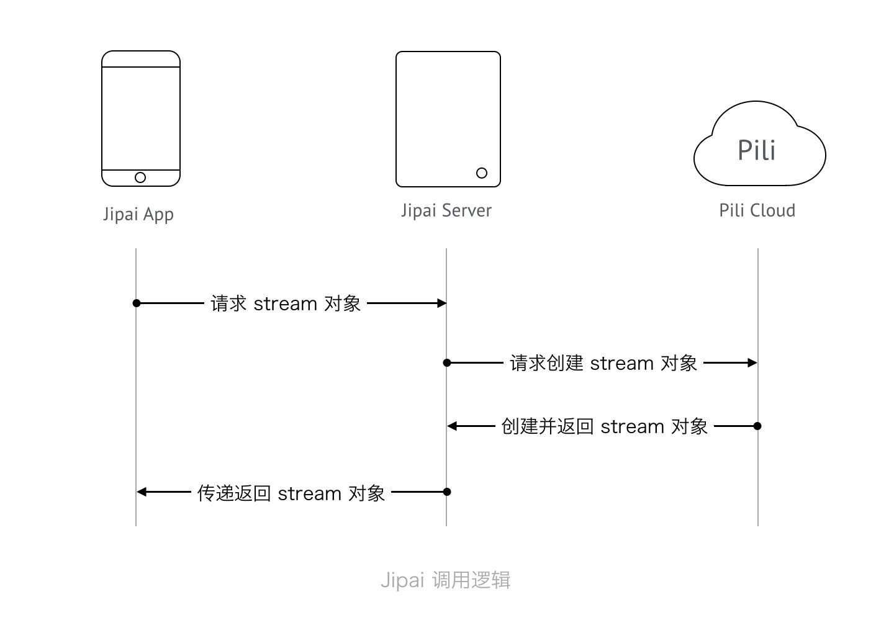

# Jipai server in Node.js

这是基于 Pili Streaming Cloud 实现的一个轻量级业务后台, 配合 [Jipai App](https://github.com/jipaiapp/jipai-app-ios) 使用。

## 调用流程



## 功能

- [x] 创建直播 stream
- [x] 获取 stream
- [x] 获取 stream 的直播地址

## 核心中间件

- [pili](https://github.com/pili-engineering) 实现整体直播逻辑
- [koa](http://koajs.com) 实现 App 逻辑

## 需要

- `node` 版本为 0.11.12 以上开启 `--harmony` 或者直接使用最新版本 v4.5.0 LTS / v6.4.0 Current
- 有七牛账号, 并开通了直播权限 (如没有开通，可以通过[这里](mailto:pili@qiniu.com)发邮件申请)

## 配置及运行

### 配置

将 `config.js` 中的

```javascript
qiniu: {
    ak: 'QiniuAK',
    sk: 'QiniuSK',
    hub: 'PiliHubName'
}
```

替换为你自己七牛账号的 `Ak`, `SK`, 并将 `hub` 替换为你在 Pili 后台创建的 `hub` 对应的 `hub name`.

### 运行

```bash
$ node app.js
```

现在你在本地就运行了一个可以快速提供直播服务的 server.

## 贡献

- [0dayZh](http://github.com/0dayZh): Node.js 的服务端实现; 撰写文档; 绘制文档配图

## License

- 源码基于 [MIT License](https://opensource.org/licenses/MIT) 开源
- 所有文档及资源（图片）基于 [CC-BY-DN](https://creativecommons.org/licenses/by-nd/2.0/) 开放授权
